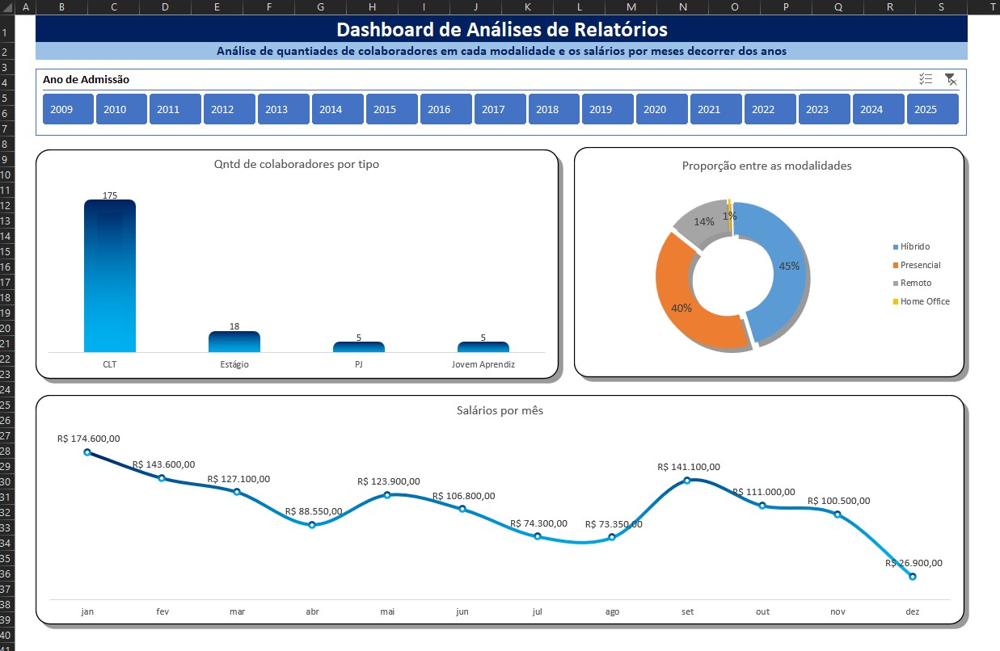

# 📊 Dashboard de Análise de Departamento Pessoal: Unificação e Visão Estratégica com Power Query

## 📋 Sobre o Projeto
Este projeto tem como objetivo demonstrar a automação e consolidação de múltiplas bases de dados de Recursos Humanos utilizando o **Power Query** no Excel. 

Inicialmente, os dados estavam fragmentados em quatro relatórios distintos baseados no tipo de contrato dos colaboradores. Através de um processo de ETL (Extração, Transformação e Carga), os arquivos foram unificados em uma única tabela consolidada, servindo de base para um **Dashboard Gerencial** interativo. O painel permite que a gestão analise a distribuição da equipe e a evolução da folha de pagamento de forma dinâmica.

## 🛠️ Ferramentas Utilizadas
* **Microsoft Excel:** Construção de Tabelas Dinâmicas, Segmentação de Dados e elaboração do Dashboard interativo.
* **Power Query:** Processo de ETL, limpeza e anexação (append) das consultas para consolidar os múltiplos arquivos CSV/Excel em uma única base de verdade.

## ⚙️ Arquitetura e Pipeline de Dados
1. **Extração:** Coleta de 4 relatórios individuais de colaboradores (`Relatório CLT`, `Relatório Estágio`, `Relatório Jovem Aprendiz` e `Relatório PJ`).
2. **Transformação (Power Query):** Conexão com a pasta/arquivos de origem e utilização da função de "Anexar Consultas" para empilhar os dados, criando o arquivo mestre `dashboard_analises_relatorios`.
3. **Carga e Visualização:** Criação de Tabelas Dinâmicas conectadas à base consolidada para alimentar as visualizações do Dashboard.

## 📈 Visões do Dashboard
O painel foi construído focado na facilidade de uso e extração rápida de *insights*, contendo:

* **Filtros Interativos (Segmentação de Dados):** Controle deslizante por **Ano**, permitindo a análise temporal e filtragem rápida de toda a tela.
* **Volume de Colaboradores (Gráfico de Barras):** Demonstra a quantidade total de funcionários ativos, permitindo entender o tamanho da operação.
* **Proporção por Modalidade (Gráfico de Rosca):** Evidencia a distribuição percentual das modalidades de trabalho (Presencial, Híbrido, Remoto, Home Office).
* **Evolução Salarial (Gráfico de Linhas):** Acompanhamento da soma dos salários mensais no decorrer dos meses, essencial para a previsibilidade financeira e controle da folha de pagamento.

## 📸 Preview do Dashboard

## 🚀 Como Executar o Projeto
1. Clone este repositório: `git clone https://github.com/abu-bokkor/seu-repositorio.git`
2. Faça o download dos arquivos `.xlsx` e `.csv` contidos na pasta de dados.
3. Abra o arquivo principal `dashboard_analises_relatorios.xlsx`.
4. Caso o Excel solicite, clique em "Habilitar Conteúdo" para garantir que a conexão do Power Query e as Tabelas Dinâmicas funcionem perfeitamente. Utilize a segmentação de dados para interagir com o Dashboard.

---
*Projeto desenvolvido por [Abu Bokkor](https://www.linkedin.com/in/bokkor) - Focado na transição para Análise de Dados e Business Intelligence.*
